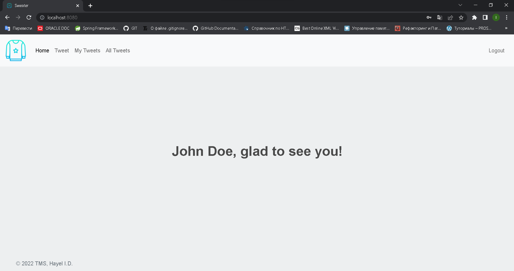
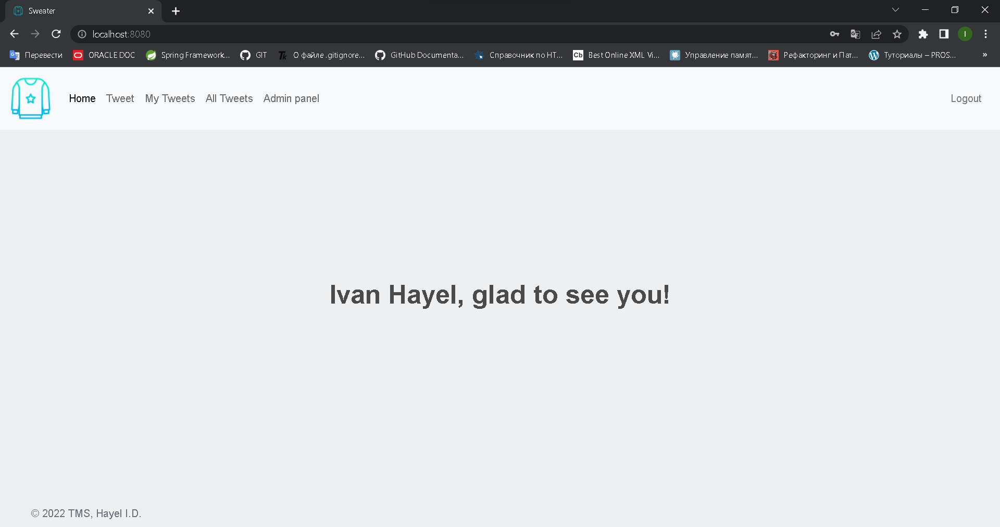
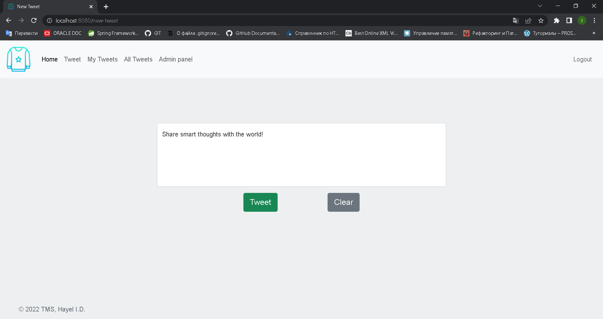

# TeachMeSkills homework Lesson 28

## Sweater `SOLUTION IN PROGRESS`

--- 

## Table of contents

### 1. [Task](https://github.com/IvanHayel/TeachMeSkills_HW_Lesson_28_Sweater#task)

### 2. [Database structure](https://github.com/IvanHayel/TeachMeSkills_HW_Lesson_28_Sweater#database-structure)

### 3. [Current view](https://github.com/IvanHayel/TeachMeSkills_HW_Lesson_28_Sweater#current-view)

--- 

### Task

> Create an analogue of a social network.

---

### Database structure

### Current view

#### Home without authorization

#### Registration

#### Authorization

#### Home page for common user

#### Home page for administrator

#### New Tweet page

#### My Tweets page

#### Post edit page

#### Comments and likes to tweet

