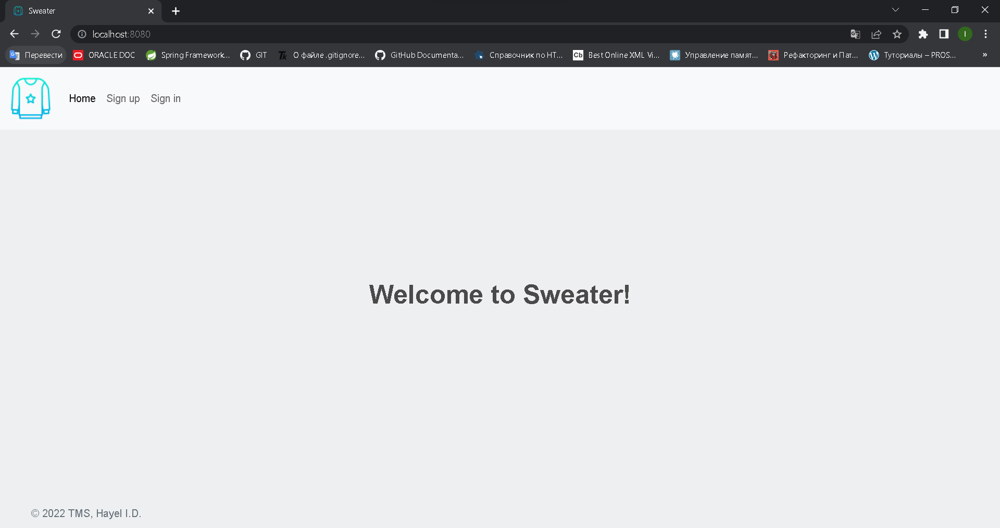
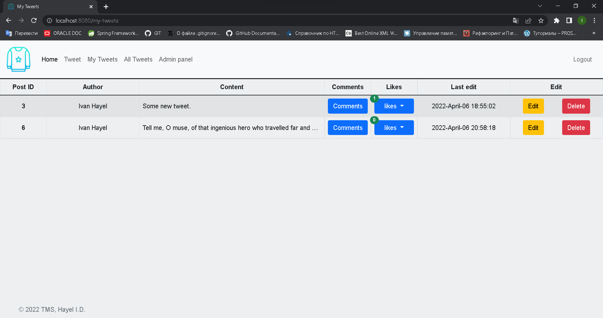

# TeachMeSkills homework Lesson 28

## Sweater `SOLUTION IN PROGRESS`

--- 

## Table of contents

### 1. [Task](https://github.com/IvanHayel/TeachMeSkills_HW_Lesson_28_Sweater#task)

### 2. [Database creation script](https://github.com/IvanHayel/TeachMeSkills_HW_Lesson_28_Sweater#database-creation-script)

### 3. [Database structure](https://github.com/IvanHayel/TeachMeSkills_HW_Lesson_28_Sweater#database-structure)

### 4. [Current view](https://github.com/IvanHayel/TeachMeSkills_HW_Lesson_28_Sweater#current-view)

--- 

### Task

> Create an analogue of a social network.

---

### Database creation script

```sql
CREATE DATABASE social_network;
USE social_network;

CREATE TABLE `comments`
(
    `id`        int           NOT NULL,
    `post_id`   int           NOT NULL,
    `author_id` int           NOT NULL,
    `content`   varchar(2048) NOT NULL,
    `timestamp` timestamp     NOT NULL DEFAULT CURRENT_TIMESTAMP
) ENGINE = InnoDB
  DEFAULT CHARSET = utf8mb4
  COLLATE = utf8mb4_0900_ai_ci;

CREATE TABLE `posts`
(
    `id`        int       NOT NULL,
    `author_id` int            DEFAULT NULL,
    `content`   varchar(2048)  DEFAULT NULL,
    `likes`     varchar(1024)  DEFAULT NULL,
    `timestamp` timestamp NULL DEFAULT CURRENT_TIMESTAMP,
    PRIMARY KEY (`id`)
) ENGINE = InnoDB
  DEFAULT CHARSET = utf8mb4
  COLLATE = utf8mb4_0900_ai_ci;

CREATE TABLE `roles`
(
    `id`           int NOT NULL,
    `name`         varchar(32) DEFAULT NULL,
    `access_level` int         DEFAULT NULL,
    PRIMARY KEY (`id`)
) ENGINE = InnoDB
  DEFAULT CHARSET = utf8mb4
  COLLATE = utf8mb4_0900_ai_ci;

CREATE TABLE `users`
(
    `id`       int NOT NULL,
    `login`    varchar(32) DEFAULT NULL,
    `password` varchar(32) DEFAULT NULL,
    `email`    varchar(64) DEFAULT NULL,
    `name`     varchar(32) DEFAULT NULL,
    `surname`  varchar(32) DEFAULT NULL,
    PRIMARY KEY (`id`)
) ENGINE = InnoDB
  DEFAULT CHARSET = utf8mb4
  COLLATE = utf8mb4_0900_ai_ci;

CREATE TABLE `user_roles`
(
    `user_id` int NOT NULL,
    `role_id` int NOT NULL
) ENGINE = InnoDB
  DEFAULT CHARSET = utf8mb4
  COLLATE = utf8mb4_0900_ai_ci;
```

### Database structure


### Current view

#### Home without authorization



#### Registration


#### Registration mail to owner


#### Authorization


#### Home page for common user


#### Home page for administrator


#### New Tweet page


#### My Tweets page



#### Post edit page


#### All Tweets page


#### Tweet page


#### Admin panel


